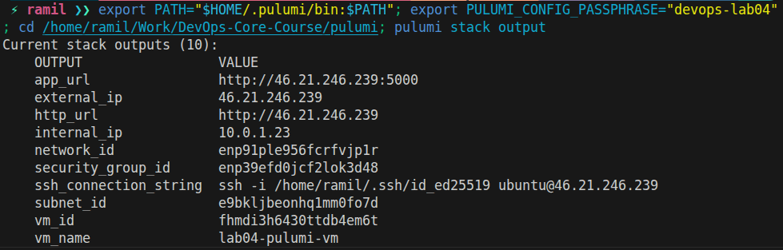

# Lab 4 - Infrastructure as Code (Terraform & Pulumi)

## Cloud Provider and Infrastructure

**Provider**: Yandex Cloud
**Region/Zone**: ru-central1-a
**Instance size**: 2 vCPU (20% guaranteed), 1 GB RAM, 10 GB HDD
**Cost**: Free tier

Resources created:
- VPC network
- Subnet
- Security group (SSH, HTTP, port 5000)
- VM (Ubuntu 22.04)

Screenshots:
- Terraform outputs: 
- Pulumi outputs: 

## Task 1 - Terraform (Yandex Cloud)

**Location**: `terraform/yandex/`

**Terraform version**:
```
Terraform v1.14.3
```

**Terraform init output**:
```
Initializing the backend...
Initializing provider plugins...
- Reusing previous version of yandex-cloud/yandex from the dependency lock file
- Using previously-installed yandex-cloud/yandex v0.99.1

Terraform has been successfully initialized!
```

**Terraform plan output**:
```
No changes. Your infrastructure matches the configuration.
```

**Terraform apply output**:
```
Apply complete! Resources: 0 added, 0 changed, 0 destroyed.

Outputs:
app_url = "http://93.77.186.203:5000"
external_ip = "93.77.186.203"
http_url = "http://93.77.186.203"
instance_labels = tomap({
  "env" = "learning"
  "lab" = "lab04"
  "purpose" = "devops-course"
  "tool" = "terraform"
})
internal_ip = "10.0.1.17"
network_id = "enp91ple956fcrfvjp1r"
security_group_id = "enp39efd0jcf2lok3d48"
ssh_connection_string = "ssh -i /home/ramil/.ssh/id_ed25519 ubuntu@93.77.186.203"
subnet_id = "e9bkljbeonhq1mm0fo7d"
vm_id = "fhm3hpru7qnes65fso7v"
vm_name = "lab04-vm"
```

**SSH proof**:
- Login successful (Ubuntu 22.04.5 LTS)
- Commands executed: `ls`, `echo "hello world!"`

## Task 2 - Pulumi (Yandex Cloud)

**Location**: `pulumi/`

**Pulumi version**:
```
v3.221.0
```

**Pulumi preview output**:
```
Previewing update (dev):
  + yandex:index:ComputeInstance web-vm create
Resources:
    + 3 to create
```

**Pulumi up output**:
```
Updating (dev):
  + yandex:index:ComputeInstance web-vm created (36s)
Outputs:
    app_url              : "http://84.201.157.114:5000"
    external_ip          : "84.201.157.114"
    http_url             : "http://84.201.157.114"
    internal_ip          : "10.0.1.19"
    network_id           : "enp91ple956fcrfvjp1r"
    security_group_id    : "enp39efd0jcf2lok3d48"
    ssh_connection_string: "ssh -i /home/ramil/.ssh/id_ed25519 ubuntu@84.201.157.114"
    subnet_id            : "e9bkljbeonhq1mm0fo7d"
    vm_id                : "fhmc96siapihguvq4ld8"
    vm_name              : "lab04-pulumi-vm"
```

**Cleanup**:
```
Pulumi destroy completed. Resources: 3 deleted.
```

Notes:
- Pulumi reused the existing VPC network, subnet, and security group created by Terraform.
- Pulumi VM was created for evidence and then destroyed to keep only the Terraform VM for Lab 5.

## Terraform vs Pulumi (Short Comparison)

Terraform was faster to start and produced clear errors when something failed. Pulumi required more environment setup but was more flexible for customization once the Python project was configured. For this lab, Terraform was easier to get running quickly, while Pulumi felt better for code reuse and customization.

## Lab 5 Plan

Terraform VM is kept for Lab 5. `terraform destroy` was not run.

## Files

- Terraform code: [terraform/yandex/main.tf](../terraform/yandex/main.tf)
- Terraform vars: [terraform/yandex/variables.tf](../terraform/yandex/variables.tf)
- Terraform outputs: [terraform/yandex/outputs.tf](../terraform/yandex/outputs.tf)
- Pulumi code: [pulumi/__main__.py](../pulumi/__main__.py)
- Pulumi config: [pulumi/Pulumi.yaml](../pulumi/Pulumi.yaml)
- Pulumi requirements: [pulumi/requirements.txt](../pulumi/requirements.txt)
