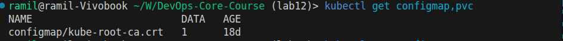
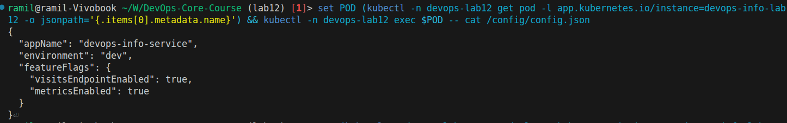
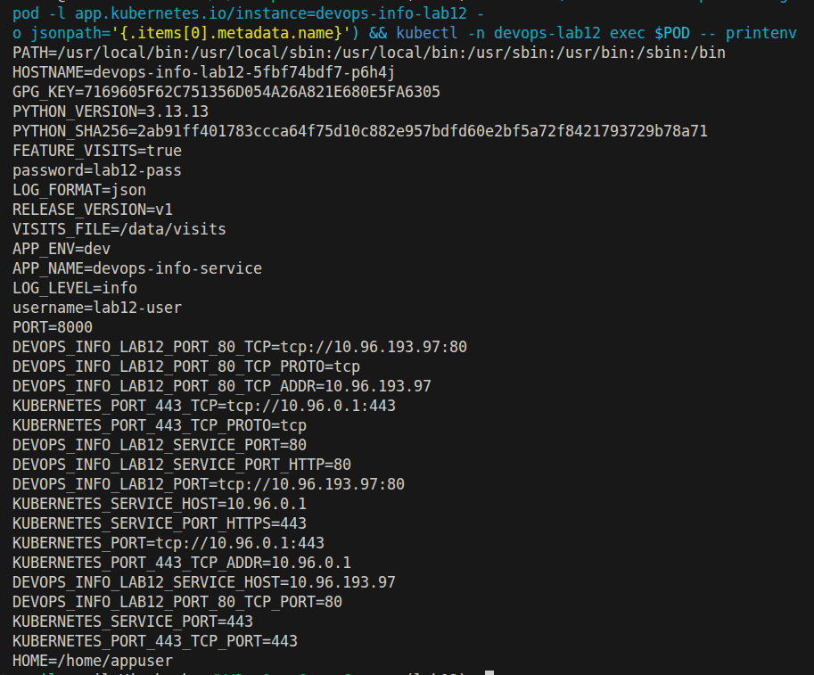
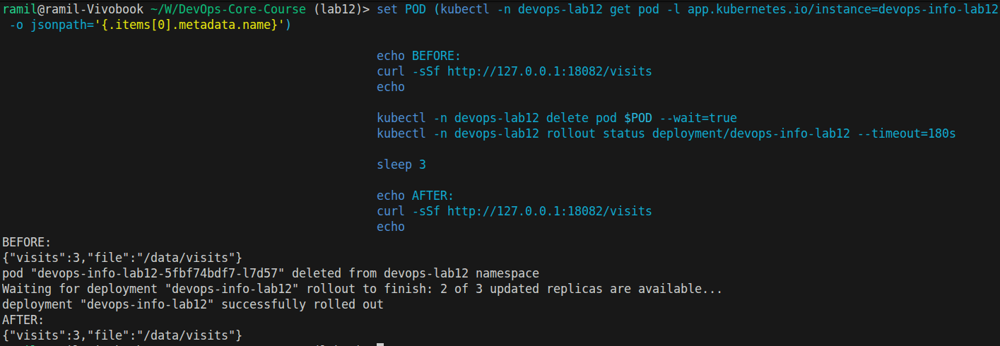

# Lab 12 - ConfigMaps and Persistent Volumes

## 1. Application Changes

Implemented in `app_python/app.py`:
- Added file-based visits counter at `VISITS_FILE` (default `/data/visits`).
- `GET /` now increments counter and persists value.
- Added `GET /visits` endpoint for current counter value.
- Added lock + atomic write (`os.replace`) for safe updates.

Updated local compose in `app_python/docker-compose.yml`:
- Volume mount: `./data:/data`
- `VISITS_FILE=/data/visits`

Local Docker evidence:

```bash
$ curl -sSf http://localhost:8000/visits
{"visits":2,"file":"/data/visits"}

$ docker compose restart app

$ curl -sSf http://localhost:8000/visits
{"visits":2,"file":"/data/visits"}

$ cat app_python/data/visits
2
```

## 2. ConfigMap Implementation

Chart additions:
- `k8s/devops-info/files/config.json`
- `k8s/devops-info/templates/configmap.yaml` (file mount via `.Files.Get`)
- `k8s/devops-info/templates/configmap-env.yaml` (env key-value pairs)

Deployment updates in `k8s/devops-info/templates/deployment.yaml`:
- Mount file ConfigMap at `/config`.
- Inject env vars via `envFrom.configMapRef`.

Cluster verification:

```bash
$ kubectl -n devops-lab12 get configmap,pvc
configmap/devops-info-lab12-config   1
configmap/devops-info-lab12-env      4
persistentvolumeclaim/devops-info-lab12-data   Bound   100Mi
```

File in pod:

```bash
$ kubectl -n devops-lab12 exec devops-info-lab12-... -- cat /config/config.json
{
  "appName": "devops-info-service",
  "environment": "dev",
  "featureFlags": {
    "visitsEndpointEnabled": true,
    "metricsEnabled": true
  }
}
```

Env vars in pod:

```bash
$ kubectl -n devops-lab12 exec devops-info-lab12-... -- printenv
APP_NAME=devops-info-service
APP_ENV=dev
FEATURE_VISITS=true
LOG_LEVEL=info
```

## 3. Persistent Volume

PVC config in `k8s/devops-info/templates/pvc.yaml`:
- Access mode: `ReadWriteOnce`
- Size from values: `100Mi`
- StorageClass configurable (`persistence.storageClass`)
- Mounted to `/data`

Persistence test:

```bash
$ curl -sSf http://127.0.0.1:18082/visits
{"visits":3,"file":"/data/visits"}

$ kubectl -n devops-lab12 delete pod devops-info-lab12-5fbf74bdf7-kcst9 --wait=true
$ kubectl -n devops-lab12 rollout status deployment/devops-info-lab12
deployment "devops-info-lab12" successfully rolled out

$ curl -sSf http://127.0.0.1:18082/visits
{"visits":3,"file":"/data/visits"}

$ kubectl -n devops-lab12 exec devops-info-lab12-5fbf74bdf7-z57mz -- cat /data/visits
3
```

Result: counter value preserved after pod recreation.

## 4. ConfigMap vs Secret

ConfigMap:
- For non-sensitive config (feature flags, app env, log level).
- Plain configuration, convenient file/env injection.

Secret:
- For sensitive data (passwords, tokens, credentials).
- Access must be restricted with RBAC; for production use encryption at rest and secret manager policy.

Key differences:
- Purpose: ConfigMap for non-sensitive config, Secret for sensitive data.
- Storage format: both are base64 in API; Secret is intended for confidential values and stricter access.
- Access control: Secret should have tighter RBAC and audit controls than ConfigMap.
- Operational practice: ConfigMap can be kept as plain app settings; Secret should avoid Git plaintext and use secret rotation/manager.

## 5. Screenshots

`kubectl get configmap,pvc`:



`cat /config/config.json` inside pod:



Environment variables in pod:



Persistence test (before/after pod restart):


