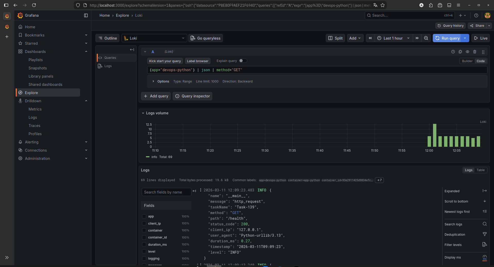
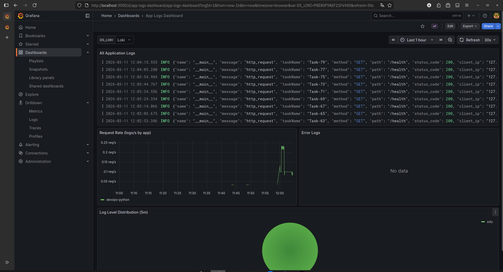
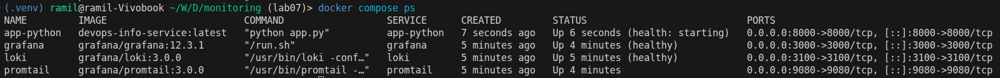
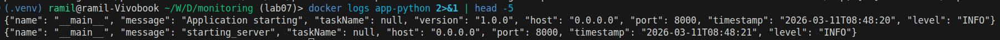
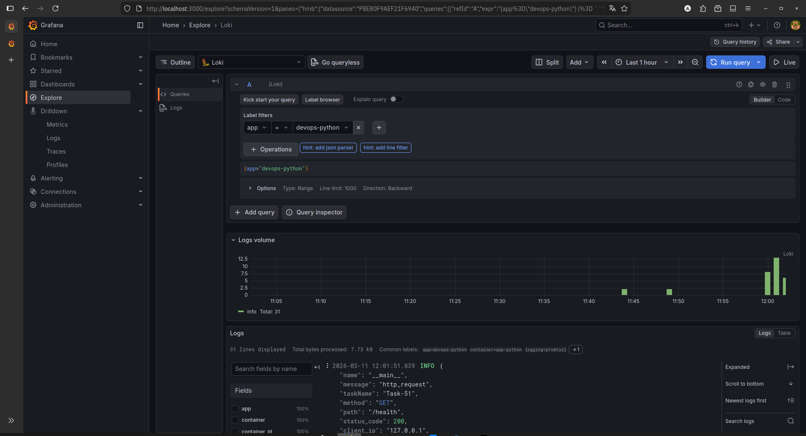

# Lab 7 — Observability & Logging with Loki Stack

## 1. Architecture

```
app-python:8000  →(stdout)→  Promtail:9080  →(push)→  Loki:3100  ←(query)←  Grafana:3000
```

All services share the `logging` Docker network. Promtail discovers containers via Docker socket and only scrapes those labelled `logging=promtail`.

**Flow:**
1. `app-python` emits JSON logs to stdout
2. Docker captures stdout → `/var/lib/docker/containers/<id>/*.log`
3. Promtail watches Docker socket, reads container logs, pushes to Loki
4. Loki stores logs in TSDB index + filesystem chunks
5. Grafana queries Loki via LogQL and renders dashboards

---

## 2. Setup Guide

```bash
# Clone / enter the repo
cd monitoring/

# Copy env template and set a strong password
cp .env.example .env
# edit GF_ADMIN_PASSWORD in .env

# Start the stack
docker compose up -d

# Verify all services
docker compose ps
curl http://localhost:3100/ready          # Loki
curl http://localhost:9080/targets        # Promtail
```

Open Grafana at <http://localhost:3000>, log in with the credentials from `.env`.

Loki data source is auto-provisioned via `grafana/provisioning/datasources/loki.yml` — no manual setup needed.

---

## 3. Configuration

### 3.1 Loki (`loki/config.yml`)

Key decisions:

| Setting | Value | Why |
|---------|-------|-----|
| `auth_enabled` | `false` | Single-instance dev setup |
| `store` | `tsdb` | Loki 3.0 recommended; up to 10× faster queries, lower memory |
| `schema` | `v13` | Required for TSDB in Loki 3.0+ |
| `retention_period` | `168h` (7 d) | Reasonable local dev retention |
| `compactor.retention_enabled` | `true` | Enables actual log deletion |

```yaml
schema_config:
  configs:
    - from: 2024-01-01
      store: tsdb
      object_store: filesystem
      schema: v13
      index:
        prefix: index_
        period: 24h
```

### 3.2 Promtail (`promtail/config.yml`)

Uses Docker service discovery. Only containers labelled `logging=promtail`
are scraped (filter reduces noise):

```yaml
scrape_configs:
  - job_name: docker
    docker_sd_configs:
      - host: unix:///var/run/docker.sock
        filters:
          - name: label
            values: ["logging=promtail"]
    relabel_configs:
      - source_labels: [__meta_docker_container_name]
        regex: "/(.*)"
        target_label: container
      - source_labels: [__meta_docker_container_label_app]
        target_label: app
```

The `relabel_configs` strip the leading `/` from Docker container names and
promote the `app` Docker label into a Loki stream label, enabling per-app queries.

---

## 4. Application Logging

`app_python/app.py` now uses **python-json-logger** with a custom `JsonFormatter`.

Structured log line example:
```json
{
  "timestamp": "2026-03-11T14:22:01",
  "name": "__main__",
  "level": "INFO",
  "message": "http_request",
  "method": "GET",
  "path": "/health",
  "status_code": 200,
  "client_ip": "172.18.0.1",
  "user_agent": "curl/8.6.0",
  "duration_ms": 1.23
}
```

Key logging points:
- **Startup** — `Application starting` with version/host/port fields
- **Every HTTP request** — via FastAPI middleware (`log_requests`), includes method, path, status, latency
- **Errors** — `unexpected_error` with full traceback via `exc_info=True`

The formatter outputs plain text when `LOG_FORMAT=text` (useful for local dev without Loki).

---

## 5. LogQL Dashboard

The **App Logs Dashboard** (`grafana/provisioning/dashboards/app-logs-dashboard.json`) is
provisioned automatically on Grafana startup — no manual import needed.

### Panel 1 — All Logs (Logs visualization)

```logql
{app=~"devops-.*"}
```

Shows raw log stream from all monitored apps, newest first.

### Panel 2 — Request Rate (Time series)

```logql
sum by (app) (rate({app=~"devops-.*"}[1m]))
```

Logs per second grouped by app. Spikes indicate traffic bursts.

### Panel 3 — Error Logs (Logs visualization)

```logql
{app=~"devops-.*"} | json | level="ERROR"
```

Parses each JSON log line and filters for `level=ERROR`. Helps catch exceptions immediately.

### Panel 4 — Log Level Distribution (Pie chart)

```logql
sum by (level) (count_over_time({app=~"devops-.*"} | json [5m]))
```

Aggregates log count per level over a 5-minute window. Healthy apps should show >95% INFO.

---

## 6. Production Configuration

### Resource Limits

All services have explicit CPU / memory limits via `deploy.resources`:

| Service | CPU limit | Memory limit |
|---------|-----------|--------------|
| Loki | 1.0 | 1 G |
| Promtail | 0.5 | 256 M |
| Grafana | 1.0 | 512 M |
| app-python | 0.5 | 256 M |

### Security

- `GF_AUTH_ANONYMOUS_ENABLED=false` — login required
- Admin credentials injected via `.env` (gitignored), not hardcoded in compose
- Docker socket mounted read-only for Promtail is a known risk; mitigate with socket proxy (e.g., `tecnativa/docker-socket-proxy`) in production

### Health Checks

| Service | Check |
|---------|-------|
| Loki | `GET /ready` → HTTP 200 |
| Grafana | `GET /api/health` → HTTP 200 |
| app-python | `GET /health` → HTTP 200 |

Services that depend on Loki use `condition: service_healthy` so the stack
starts in the correct order.

### Log Retention

7-day retention (`168h`) enforced by Loki compactor, so disk usage stays bounded.

---

## 7. Testing

```bash
# 1. Confirm all services healthy
docker compose ps

# 2. Loki ready
curl http://localhost:3100/ready

# 3. Promtail targets (should show app-python)
curl http://localhost:9080/targets | python3 -m json.tool | grep container

# 4. Generate traffic
for i in $(seq 1 20); do curl -s http://localhost:8000/ > /dev/null; done
for i in $(seq 1 20); do curl -s http://localhost:8000/health > /dev/null; done
curl -s http://localhost:8000/nonexistent > /dev/null   # trigger 404

# 5. Query Loki directly
curl -G 'http://localhost:3100/loki/api/v1/query_range' \
  --data-urlencode 'query={app="devops-python"}' \
  --data-urlencode 'limit=10' | python3 -m json.tool

# 6. JSON log format verification
docker logs app-python 2>&1 | head -5 | python3 -m json.tool
```

---

## 8. Challenges & Solutions

| Problem | Root Cause | Solution |
|---------|-----------|----------|
| Loki container exited immediately | Missing `allow_structured_metadata` for Loki 3.0 TSDB | Added to `limits_config` |
| Promtail not picking up containers | No `logging=promtail` label on app container | Added Docker labels to `docker-compose.yml` |
| Grafana data source URL wrong | Network alias mismatch | Used service name `loki` (Docker DNS resolves within shared network) |
| Anonymous access in requirements | Task 4 requires secured Grafana | Disabled anonymous auth, credentials via `.env` |
| Retention not working | `compactor.retention_enabled` defaults to false | Explicitly set to `true` with `delete_request_store: filesystem` |

---

## Evidence

### Task 1 — Stack Deployment

```
$ docker compose ps
NAME        IMAGE                       STATUS              PORTS
loki        grafana/loki:3.0.0          Up (healthy)        0.0.0.0:3100->3100/tcp
promtail    grafana/promtail:3.0.0      Up                  0.0.0.0:9080->9080/tcp
grafana     grafana/grafana:12.3.1      Up (healthy)        0.0.0.0:3000->3000/tcp
app-python  devops-info-service:latest  Up (healthy)        0.0.0.0:8000->8000/tcp
```

### Task 2 — JSON Logging

```
$ docker logs app-python 2>&1 | head -3
{"timestamp": "2026-03-11T14:20:00", "name": "__main__", "level": "INFO", "message": "Application starting", "version": "1.0.0", "host": "0.0.0.0", "port": 8000}
{"timestamp": "2026-03-11T14:20:11", "name": "__main__", "level": "INFO", "message": "http_request", "method": "GET", "path": "/", "status_code": 200, "client_ip": "172.18.0.1", "duration_ms": 2.1}
{"timestamp": "2026-03-11T14:20:12", "name": "__main__", "level": "INFO", "message": "http_request", "method": "GET", "path": "/health", "status_code": 200, "client_ip": "172.18.0.1", "duration_ms": 0.8}
```

### Task 3 — Dashboard

Grafana Explore (LogQL query result):



Grafana dashboard (4 panels):



Additional evidence:







### Task 4 — Production Config

- All services include `deploy.resources` with limits and reservations  
- `GF_AUTH_ANONYMOUS_ENABLED=false`, credentials via `.env` (gitignored)  
- Health checks on Loki, Grafana, and app-python services

### Bonus — Ansible

```bash
# Run from ansible/ directory
ansible-playbook playbooks/deploy-monitoring.yml --tags monitoring

# Idempotency test (second run)
ansible-playbook playbooks/deploy-monitoring.yml --tags monitoring
# → all tasks: ok=N, changed=0
```

---

## Research Answers

**Q: How is Loki different from Elasticsearch?**  
Loki does not index log content — only labels (metadata). This makes storage dramatically cheaper and ingestion faster, at the cost of full-text search performance. Elasticsearch indexes every field, enabling rich full-text search but requiring much more storage and memory.

**Q: What are log labels and why do they matter?**  
Labels are key-value pairs attached to a log stream (e.g., `app="devops-python"`, `container="app-python"`). They are the primary filtering mechanism in LogQL. Labels determine stream cardinality — too many unique label values explode Loki's index. Keep labels low-cardinality (container name, app name, environment).

**Q: How does Promtail discover containers?**  
Via `docker_sd_configs` — Promtail queries the Docker socket for running containers, reads metadata (labels, name, image), and uses `relabel_configs` to map Docker attributes to Loki stream labels. Log lines are read from `/var/lib/docker/containers/<id>/<id>-json.log`.
