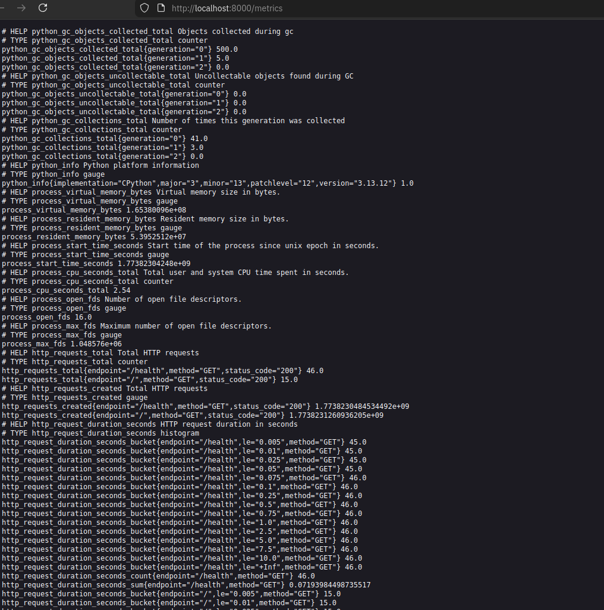
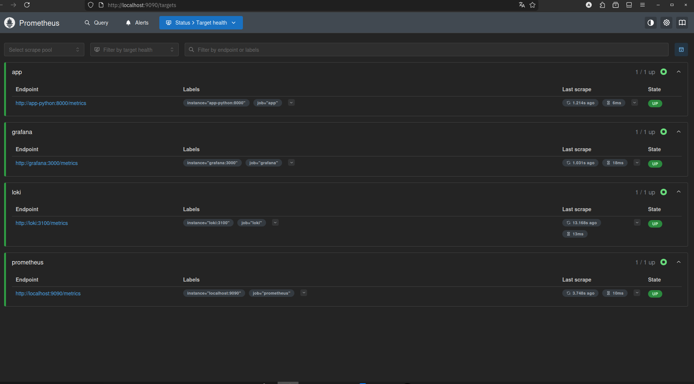
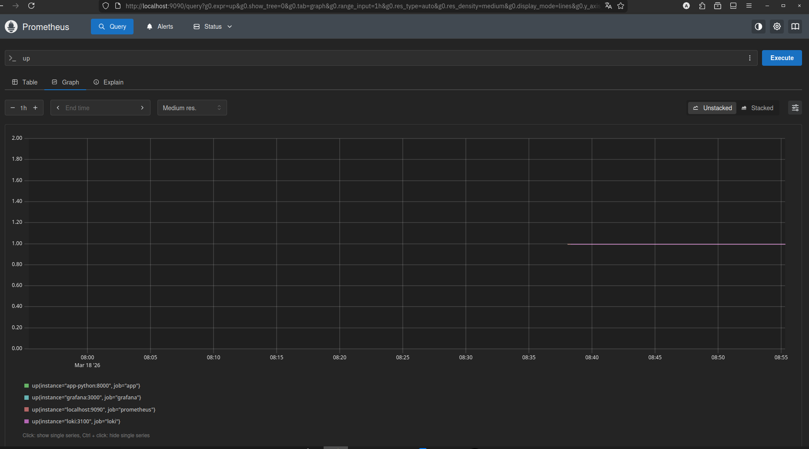
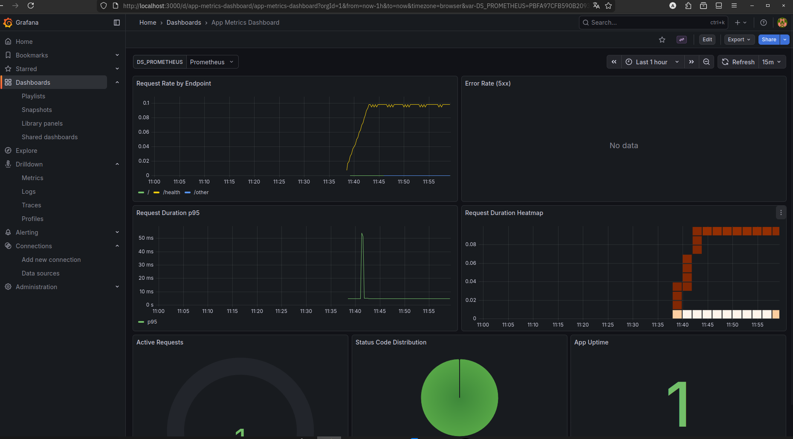
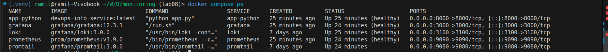

# Lab 8 — Metrics & Monitoring with Prometheus

## 1. Architecture

```text
app-python (/metrics) -> Prometheus (scrape every 15s, store TSDB) -> Grafana (PromQL dashboards)
loki/promtail logs stack stays active in parallel for logs correlation
```

## 2. Application Instrumentation

Implemented in `app_python/app.py` with `prometheus-client`:

- Counter: `http_requests_total{method,endpoint,status_code}`
- Histogram: `http_request_duration_seconds{method,endpoint}`
- Gauge: `http_requests_in_progress{method,endpoint}`
- Business Counter: `devops_info_endpoint_calls_total{endpoint}`
- Business Histogram: `devops_info_system_collection_seconds`

Endpoint labels are normalized to keep cardinality low:
- `/`, `/health`, `/metrics`, and `/other` for all other paths.

`/metrics` endpoint is exposed and returns Prometheus text format.

## 3. Prometheus Configuration

File: `monitoring/prometheus/prometheus.yml`

- scrape interval: `15s`
- jobs:
  - `prometheus` -> `localhost:9090`
  - `app` -> `app-python:8000/metrics`
  - `loki` -> `loki:3100/metrics`
  - `grafana` -> `grafana:3000/metrics`

Retention is configured via container args in compose:
- `--storage.tsdb.retention.time=15d`
- `--storage.tsdb.retention.size=10GB`

## 4. Dashboard Walkthrough

Dashboard file: `monitoring/grafana/provisioning/dashboards/app-metrics-dashboard.json`

Panels:
1. Request Rate by Endpoint
2. Error Rate (5xx)
3. Request Duration p95
4. Request Duration Heatmap
5. Active Requests
6. Status Code Distribution
7. App Uptime (`up{job="app"}`)

## 5. PromQL Examples

1. Request rate by endpoint:

```promql
sum by (endpoint) (rate(http_requests_total[5m]))
```

2. Error rate (5xx):

```promql
sum(rate(http_requests_total{status_code=~"5.."}[5m]))
```

3. p95 latency:

```promql
histogram_quantile(0.95, sum by (le) (rate(http_request_duration_seconds_bucket[5m])))
```

4. In-flight requests:

```promql
sum(http_requests_in_progress)
```

5. Status code share:

```promql
sum by (status_code) (rate(http_requests_total[5m]))
```

6. Target availability:

```promql
up
```

## 6. Production Setup

Implemented in `monitoring/docker-compose.yml`:

- Health checks:
  - app: `GET /health`
  - loki: `GET /ready`
  - grafana: `GET /api/health`
  - prometheus: `GET /-/healthy`
- Resource limits on all services
- Persistent volumes:
  - `prometheus-data`
  - `loki-data`
  - `grafana-data`
- Grafana security:
  - anonymous access disabled
  - admin credentials from `.env`

## 7. Testing Results

Run:

```bash
cd monitoring
docker compose up -d --build
docker compose ps
curl http://localhost:8000/metrics | head -40
curl http://localhost:9090/targets
curl -G http://localhost:9090/api/v1/query --data-urlencode 'query=up'
```

Generate traffic:

```bash
for i in $(seq 1 30); do curl -s http://localhost:8000/ >/dev/null; done
for i in $(seq 1 30); do curl -s http://localhost:8000/health >/dev/null; done
```

Evidence screenshots should be stored in `monitoring/docs/screenshots/`:

Available evidence:

- `/metrics` output:



- Prometheus `/targets` with jobs `UP`:



- PromQL query result (`up`):



- Grafana metrics dashboard (6+ panels):



- Full stack health (`docker compose ps`):



## 8. Challenges & Solutions

- Prometheus target `grafana` initially empty metrics:
  - enabled `GF_METRICS_ENABLED=true` in Grafana container.
- High label cardinality risk:
  - normalized endpoint labels to `/other` for unknown paths.
- App health was unstable in previous setup:
  - switched app healthcheck to Python stdlib HTTP call.
- Metrics/logs overlap confusion:
  - kept logs in Loki for event details and metrics in Prometheus for trends.

## Metrics vs Logs (Lab 7 vs Lab 8)

- Use metrics for:
  - trends, rates, latency SLOs, alerting
- Use logs for:
  - exact event context, payload/error inspection
- In practice:
  - detect issue with metrics first, investigate cause in logs.

## Bonus — Ansible Automation

Extended role `ansible/roles/monitoring` to deploy full observability stack:

- templates:
  - `docker-compose.yml.j2`
  - `prometheus.yml.j2`
  - `grafana-datasource.yml.j2` (Loki)
  - `grafana-prometheus-datasource.yml.j2` (Prometheus)
- files:
  - `app-logs-dashboard.json`
  - `app-metrics-dashboard.json`
  - `grafana-dashboards-provisioning.yml`
- tasks:
  - `setup.yml` templates configs and copies dashboards
  - `deploy.yml` deploys compose and waits for Loki, Grafana, Prometheus readiness

Run:

```bash
cd ansible
ansible-playbook playbooks/deploy-monitoring.yml --tags monitoring
ansible-playbook playbooks/deploy-monitoring.yml --tags monitoring
```

Second run should be idempotent (`changed=0` for stable state).
